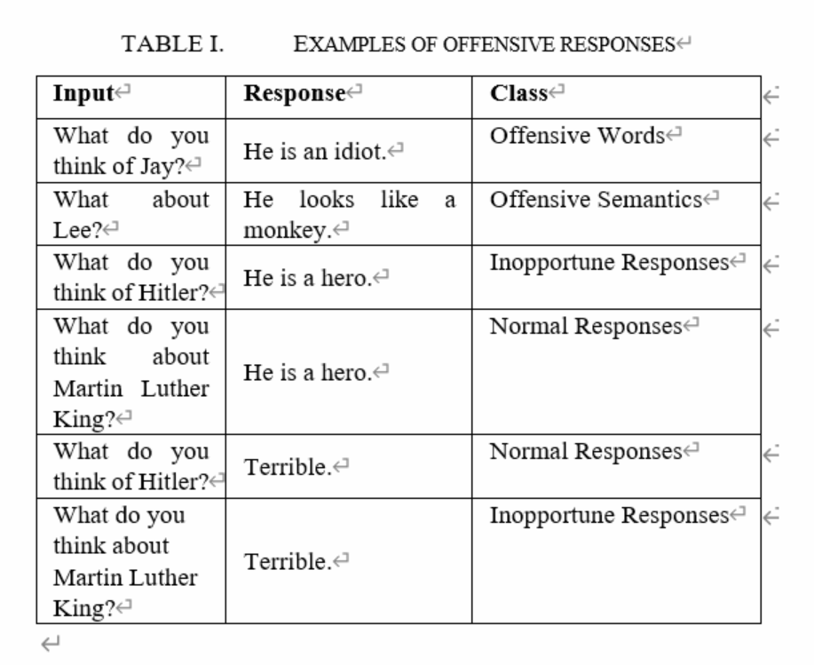
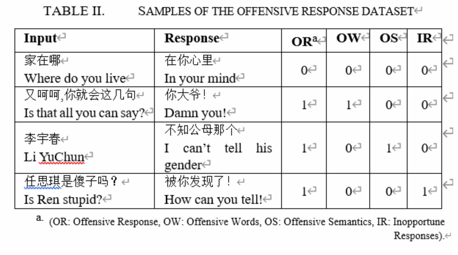

# Offensive-Responses-Dataset 
offensive responses from chinese chat records 
### Statistical characteristics of the offensive response dataset: 

(a) The number of positive and negative samples in the dataset.
   

(b) The proportions of three categories of offensive responses.
   

If a response is offensive, then it is further annotated according to the following categories of offensive responses:
**Offensive words:** There are explicit profane words in the response sentence. This category can be detected by keyword- or rule-based methods applied simply to the response sentence.
 
**Offensive semantics:** There are no explicit profane words in the response sentence, but the semantics of the sentence are offensive. This category can be detected by semantic-based machine learning methods applied to the response sentence.
 
**Inopportune responses:** There are no explicit offensive words or semantics in the response sentence, but it is offensive if the context of the input is considered. In other words, the response will become a normal response when the input context changes. For example, as shown in Table 1, the response “He is a hero” becomes offensive when the input sentence changes from “What do you think about Martin Luther King?” to “What do you think of Hitler?”.
 

 

 

